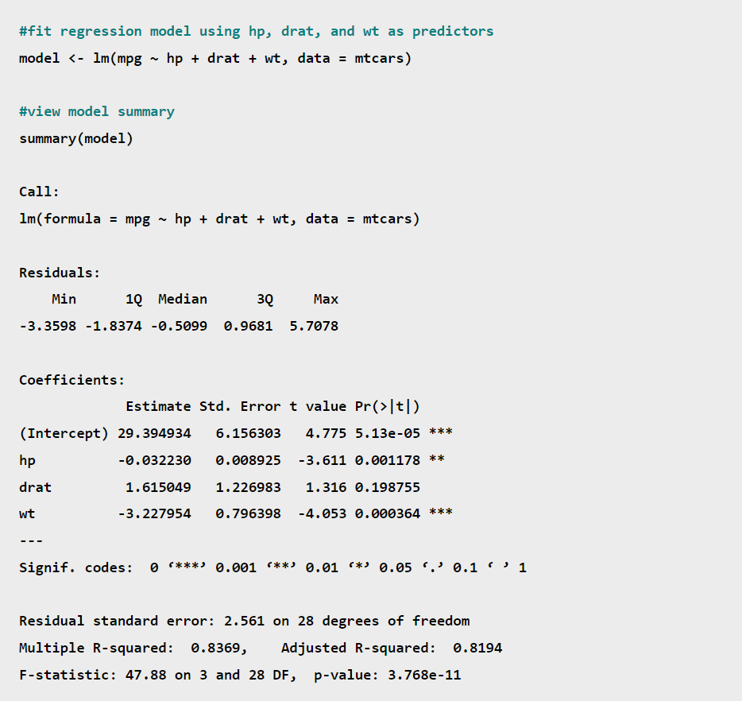

# Linear Regression

## Loading a module

To load a **module**, also called **library**, we use the function `library()`.

```{r}
# loading libraries
library(MASS)
library(ISLR2)
```

## Simple Linear Regression

We are going to use the **Boston** dataset which contains the `medv` for $506$ houses in Boston. There are $12$ predictors that we will use to predict the medv.

```{r}
# first rows
head(Boston)
```

To perform a simple linear regression we use the `lm()`function.

```{r}
# linear regression
lm.fit = lm(medv ~ lstat, data=Boston)
lm.fit
```

As we can see, we obtained both the value of the intercept as well as the slope. To get more information about the regression we did, we can use the function `summary()`

```{r}
summary(lm.fit)
```

To find other pieces of information stocked in `lm.fit` we can use `names()`

```{r}
# fitted model attributes
names(lm.fit)
```

Even if we are able to access the content of these attributes thanks to their names, but it is preferable to use extractor functions

```{r}
# example:
#coefficients
coef(lm.fit)

#confidence intervals
confint(lm.fit)
```

We can use the function `predict` to produce prediction and confidence intervals for the prediction of `medv` for a given value of `lstat`

```{r}
# confidence intervals
predict(lm.fit, data.frame(lstat=(c(10,5,89))), interval="confidence")
```

```{r}
# prediction intervals
predict(lm.fit, data.frame(lstat=(c(10,5,89))), interval="prediction")
```

As we can see, prediction intervals are wider than confidence intervals which was expected.

Finally, we can plot the least squares line.

```{r}
plot(Boston$lstat,
     Boston$medv,
        pch="+") # shape of points
abline(lm.fit,
       col='red', #color
       lwd=2, #line width
)
```

`abline` is not only used for plotting regression lines but any line given its intercept and slope, but only used to ***add*** straight line to a plot

```{r}
# bx + a
x = seq(10)
y = seq(10)
plot(x, y)
abline(3, 2)
```

After doing our regression, we should do some **diagnostic plots**.

```{r}
# to show all the 4 plots simultaneously
par(mfrow= c(2,2)) # like subplots
plot(lm.fit)
```

We can, alternatively, get the **residuals** and the **studentized residuals** using some functions:

```{r}
# residuals
plot(predict(lm.fit), residuals(lm.fit))

# there is a pattern => not really linear
```

```{r}
# studentized residuals
plot(predict(lm.fit), rstudent(lm.fit))
```

It is also possible to compute and plot the high leverage scores **hat values**.

```{r}
# plotting hatvalues
plot(hatvalues(lm.fit))
```

Finally, we can determine the high leverage points, those having the largest leverage score.

```{r}
which.max(hatvalues(lm.fit))
```

## Multiple Linear Regression

Like the simple linear regression, we are going to use the function `lm()` once again.

```{r}
# linear regression with two predictors: lstat and age
lm.fit = lm(medv ~ lstat + age, data = Boston)
summary(lm.fit)
```

Before proceeding, here is how we interpret the significance codes in `R`



**Interpretation:**

-   *hp* has a p-value of **.001178**. Since this value is in the range **(0.001, 0.01]**, it has a significance code of **\*\***

-   *drat* has a p-value of **.198755**. Since this value is in the range **(0.1, 1]**, it has no significance code.

-   *wt* has a p-value of **.000364**. Since this value is in the range **[0, 0.001]**, it has a significance code of **\*\*\***

> If we used an alpha level of $\alpha = 0.05$ to determine which predictors were significant in this regression model, we'd say that *hp* and *wt* are statistically significant predictors while *drat* is not.

------------------------------------------------------------------------

Back, now, as we may have noticed, for a problem having a lot of predictors we are not going to write the sum of all the predictors.

```{r}
# power of .
lm.fit = lm(medv ~ ., data = Boston)
summary(lm.fit)
```

We can also access individual components for the summary object, for instance:

```{r}
# rse
summary(lm.fit)$sigma
# r^2
summary(lm.fit)$r.sq
```

To compute the variance of inflation factor to measure col-linearity, we can make use of the library `car`

```{r}
# importing the library car
library(car)

# computing vif
vif(lm.fit)

```

How to exclude some variables of the regression?

```{r}
# no age / induc since they are insignificant
lm.fit = lm(medv ~ . - age - indus, data = Boston)
summary(lm.fit)
vif(lm.fit)
```

Another alternative is using the `update` function

```{r}
lm.fit = update(lm.fit, ~ . -age)
summary(lm.fit)
```

## Interaction term

There are two ways to include an interaction term:

1.  `lstat:age` include the interaction term between those two
2.  `lstat*age` include both variables and their corresponding interaction term

```{r}
lm.fit = update(lm.fit, ~ . +crim:zn)
summary(lm.fit)
```

## Non linear transformations of the predictors

The `lm()` function can also accommodate non-linear transformations of the predictors. For instance, given a predictor $X$ we can create a predictor $X^2$ using `I(X^2)`.

It is mandatory to use the function `I()`

```{r}
lm.fit2 = lm(medv ~ lstat + I(lstat^2),
             data = Boston)
summary(lm.fit2)
```

As we can see, the $p$-value associated with the quadratic term leads to an improvement. We can use the `anova()` function. **Analysis of variance** (**ANOVA**) is a collection of [statistical models](https://en.wikipedia.org/wiki/Statistical_model "Statistical model") and their associated estimation procedures (such as the "variation" among and between groups) used to analyze the differences among means.

```{r}
# anova()
lm.fit = lm(medv ~ lstat, data = Boston)
anova(lm.fit, lm.fit2)
```

**Interpretation**

-   **Model** $1$ \> Represents the model with only one predictor.

-   **Model** $2$ \> Represents the model with the quadratic model

    The anova function performs a hypothesis test to compare the two models.

-   **Null Hypothesis** \> the two models fit the data equally well

-   **Alternative Hypothesis** \> the full model is superior

    The **F-statistic** is $135$ and the associated \$p\$-value is virtually $0$. Thus, the full model is superior.

    ```{r}
    par(mfrow = c(2, 2))
    plot(lm.fit2)
    ```

The pattern now has disappeared.

A better approach to do polynomial regression, we will use the function `poly()` instead of `I()`.

```{r}
lm.fit5 = lm(medv ~ poly(lstat, 5), data = Boston)
summary(lm.fit5)
```

-   Didn't understand this part \>\>

By default, the `poly()` function orthogonalizes the predictors: this means that the features are not simply a sequence of powers of the argument.

-   We can also use other transformations like `log`.

## Qualitative predictors

We will see now how to treat qualitative predictors, with the `carseats`.

```{r}
# carseats dataset
head(Carseats)
```

```{r}
# fitting the model
lm.fit <- lm(Sales ~ . + Income:Advertising + Price:Age, 
    data = Carseats)
summary(lm.fit)
```

`R` encodes the qualitative variables, in order to retrieve the way the data was encoded.

```{r}
contrasts(Carseats$ShelveLoc)
```

```{r}
?contrasts
```

**Stackoverflow Notes**

-   Contrasts are needed when you fit linear models with factors (i.e. categorical variables) as explanatory variables. The contrast specifies how the levels of the factors will be coded into a family of numeric dummy variables for fitting the model.

-   Here are some good notes for the different varieties of contrasts used: <http://www.unc.edu/courses/2006spring/ecol/145/001/docs/lectures/lecture26.htm>

-   When the contrasts used are changed, the model remains the same in terms of the underlying joint probability distributions allowed. Only its parametrization changes. The fitted values remain the same as well. Also, once you have the value of the parameters for one choice of contrasts, it is easy to derive what the value of the parameters for another choice of contrasts would have been.

## Create Functions

```{r}
# loading libraries
LoadLibraries= function() {
  library(ISLR2)
  library(MASS)
  print("Libraries correctly loaded.")
}
```

```{r}
# test 
LoadLibraries()
```
